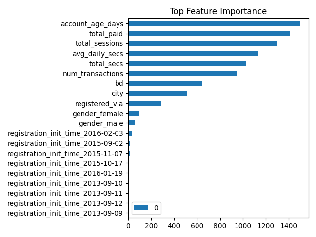

# 🚀 KKBox Churn Prediction System

End-to-end machine learning pipeline to predict customer churn using real-world subscription and user behavior data.

---

## 🎯 Objective

Predict whether a user will churn (stop subscription) and enable targeted retention strategies.

---

## 📊 Dataset

KKBox churn dataset (Kaggle):

- Transactions (payments & subscriptions)
- User logs (listening behavior)
- Members (demographics)

⚠️ Dataset not included due to size and licensing.  
Download: https://www.kaggle.com/competitions/kkbox-churn-prediction-challenge

---

## ⚙️ Pipeline

Raw Data → Feature Engineering → Model Training → Evaluation → Inference

### Key steps:
- Data preprocessing (multi-table joins)
- Feature engineering:
  - Recency (activity & transactions)
  - Frequency (usage patterns)
  - Account age
- Model: LightGBM
- Evaluation: AUC, F1-score, Recall
- Inference pipeline with feature alignment

---

## 📈 Results

| Metric | Value |
|------|------|
| AUC | ~0.80 |
| Recall (churn) | ~0.53 |
| F1-score | ~0.33 |

👉 AUC is prioritized due to strong class imbalance.

---

## 📊 Feature Importance

---

## 📦 Outputs

artifacts/
├── model.pkl
├── predictions.csv
├── feature_importance.csv
└── metrics.json

---

## 🚀 How to run

### Train
PYTHONPATH=. python src/pipeline/train_pipeline.py

### Inference
PYTHONPATH=. python src/pipeline/inference_pipeline.py

---

## 🧠 Key Learnings

- Handling large multi-table datasets
- Preventing data leakage
- Feature engineering for churn prediction
- Building production-ready ML pipelines
- Aligning training and inference features

---

## 💡 Business Use

Identify high-risk users and trigger retention actions:
- Discounts
- Emails
- Personalized offers

---

## 🔧 Tech Stack

- Python
- Pandas / Polars
- LightGBM
- Scikit-learn

---

## 📌 Author

Built as an end-to-end ML engineering project.
